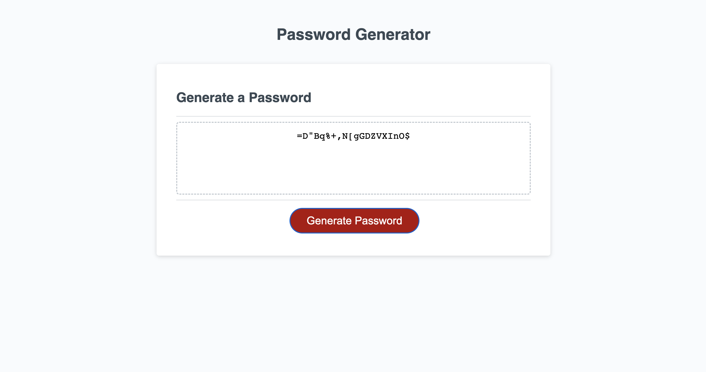

# Password Generator
This project focuses on the JavaScript code that produces a randomized unique password for the user after a series of window prompts regarding what requirements the user wants to include. 

## User Flow (Happy Path)
When the "Generate Password" button is clicked, a prompt appears to the user asking how long they want their password to be (between 8 - 128 characters).
The user can then enter their desired length.
Then it will ask the following questions via window prompt expecting a "Y" (representing "yes") or "N" (representing "no") for each response:
    - if they want to include lowercase letters
    - if they want to include uppercase letters
    - if they want to include numbers
    - if they want to include special characters
After the series of questions, and answers from the user, a randomized and unique password will appear in the center box on the UI and will only include the parameters the users has answered "Y" to.
Users may also respond with a lowercase "Y" or "N" if they wish and will still get the same result as if they used uppercase values.

## Negative flow
If a user chooses something out of the 8 - 128 character range, they will be presented with an alert stating the input is invalid.
If a user answers "N" to every prompt, they will be told that at least one criteria must be included and they will have to try again. 
If a user selects "Cancel" instead of "Ok" of the buttons in the window prompt, the prompts will desist until the user initiates the flow again byu clicking the "Generate Password" button again where they must start again from the beginning. 

### Deployed application link
[Password generator website](https://ashtreid.github.io/random-password-generator/)

### Screenshot of the website
This screenshot includes a generated password that is 20 characters long with all criteria included as the result of responding "Y" to all prompts.

